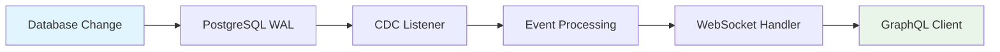

# Real-Time Subscriptions

Excalibase GraphQL provides **real-time data updates** through GraphQL subscriptions powered by PostgreSQL Change Data Capture (CDC) and WebSocket connections.

## Overview

Real-time subscriptions allow clients to receive instant notifications when database table data changes. Instead of polling for updates, clients establish WebSocket connections and receive events for INSERT, UPDATE, and DELETE operations as they occur.

<div class="feature-grid">
<div class="feature-card">
<h3>⚡ Change Data Capture</h3>
<p>Uses PostgreSQL logical replication to capture database changes in real-time without performance impact from polling.</p>
</div>

<div class="feature-card">
<h3>📡 WebSocket Transport</h3>
<p>Standards-compliant <code>graphql-transport-ws</code> protocol for reliable, persistent connections.</p>
</div>

<div class="feature-card">
<h3>💓 Connection Management</h3>
<p>Automatic heartbeat, reconnection, and graceful error handling for production reliability.</p>
</div>

<div class="feature-card">
<h3>🎯 Table-Specific Streams</h3>
<p>Subscribe to changes for specific tables with automatic data transformation and column mapping.</p>
</div>
</div>

## How It Works



1. **Database Changes**: INSERT, UPDATE, DELETE operations occur in PostgreSQL
2. **WAL Processing**: PostgreSQL writes changes to Write-Ahead Log (WAL)
3. **CDC Listener**: Consumes logical replication stream from PostgreSQL
4. **Event Processing**: Transforms raw CDC events into GraphQL-compatible format
5. **WebSocket Delivery**: Events are delivered to subscribed clients via WebSocket
6. **Client Processing**: GraphQL clients receive and process real-time updates

## GraphQL Schema

Excalibase automatically generates subscription types for each table in your database:

```graphql
type Subscription {
  # Subscribe to customer table changes
  customerChanges: CustomerSubscriptionEvent!
  
  # Subscribe to orders table changes  
  ordersChanges: OrdersSubscriptionEvent!
  
  # Subscribe to posts table changes
  postsChanges: PostsSubscriptionEvent!
}

# Event structure for table changes
type CustomerSubscriptionEvent {
  table: String!           # Table name
  schema: String!          # Database schema
  operation: String!       # INSERT, UPDATE, DELETE, HEARTBEAT, ERROR
  timestamp: String!       # ISO 8601 timestamp
  lsn: String             # PostgreSQL Log Sequence Number
  data: CustomerData      # Table row data (structure varies by operation)
  error: String           # Error message (null if no error)
}

# Data payload varies by operation type
type CustomerData {
  # For INSERT/DELETE: direct column values
  customer_id: Int
  first_name: String
  last_name: String
  email: String
  active: Boolean
  
  # For UPDATE: includes old and new values
  old: Customer           # Previous values
  new: Customer           # Updated values
}
```

## Operation Types

### INSERT Events
```json
{
  "table": "customer",
  "operation": "INSERT",
  "timestamp": "2024-01-15T10:30:45.123Z",
  "data": {
    "customer_id": 123,
    "first_name": "John",
    "last_name": "Doe",
    "email": "john.doe@example.com",
    "active": true
  },
  "error": null
}
```

### UPDATE Events
```json
{
  "table": "customer", 
  "operation": "UPDATE",
  "timestamp": "2024-01-15T10:31:15.456Z",
  "data": {
    "customer_id": 123,
    "first_name": "John",
    "last_name": "Smith",
    "email": "john.smith@example.com", 
    "active": true,
    "old": {
      "customer_id": 123,
      "first_name": "John",
      "last_name": "Doe",
      "email": "john.doe@example.com",
      "active": true
    },
    "new": {
      "customer_id": 123,
      "first_name": "John", 
      "last_name": "Smith",
      "email": "john.smith@example.com",
      "active": true
    }
  },
  "error": null
}
```

### DELETE Events
```json
{
  "table": "customer",
  "operation": "DELETE", 
  "timestamp": "2024-01-15T10:32:30.789Z",
  "data": {
    "customer_id": 123,
    "first_name": "John",
    "last_name": "Smith", 
    "email": "john.smith@example.com",
    "active": true
  },
  "error": null
}
```

### HEARTBEAT Events
```json
{
  "table": "customer",
  "operation": "HEARTBEAT",
  "timestamp": "2024-01-15T10:33:00.000Z", 
  "data": null,
  "error": null
}
```

### ERROR Events
```json
{
  "table": "customer",
  "operation": "ERROR",
  "timestamp": "2024-01-15T10:33:30.123Z",
  "data": {},
  "error": "CDC connection lost"
}
```

## Client Implementation

### JavaScript/TypeScript (graphql-ws)

Install the required dependencies:
```bash
npm install graphql-ws graphql
```

Basic subscription setup:
```javascript
import { createClient } from 'graphql-ws';

const client = createClient({
  url: 'ws://localhost:10000/graphql-ws',
  connectionParams: {
    // Add authentication headers if needed
  }
});

// Subscribe to customer changes
const subscription = client.iterate({
  query: `
    subscription {
      customerChanges {
        table
        operation
        timestamp
        lsn
        data {
          customer_id
          first_name
          last_name
          email
          active
        }
        error
      }
    }
  `
});

for await (const event of subscription) {
  const change = event.data.customerChanges;
  console.log(`${change.operation} on ${change.table}:`, change);
  
  switch (change.operation) {
    case 'INSERT':
      console.log('New customer added:', change.data);
      break;
    case 'UPDATE':
      console.log('Customer updated:', {
        old: change.data.old,
        new: change.data.new
      });
      break;
    case 'DELETE':
      console.log('Customer deleted:', change.data);
      break;
    case 'HEARTBEAT':
      console.log('Connection alive at', change.timestamp);
      break;
    case 'ERROR':
      console.error('Subscription error:', change.error);
      break;
  }
}
```

### React Hook Example

```typescript
import { useEffect, useState } from 'react';
import { createClient } from 'graphql-ws';

interface CustomerChange {
  table: string;
  operation: string;
  timestamp: string;
  data: any;
  error?: string;
}

export function useCustomerSubscription() {
  const [changes, setChanges] = useState<CustomerChange[]>([]);
  const [connected, setConnected] = useState(false);

  useEffect(() => {
    const client = createClient({
      url: 'ws://localhost:10000/graphql-ws'
    });

    const subscription = client.iterate({
      query: `
        subscription {
          customerChanges {
            table
            operation
            timestamp
            data {
              customer_id
              first_name
              last_name
              email
              active
            }
            error
          }
        }
      `
    });

    const processSubscription = async () => {
      try {
        setConnected(true);
        for await (const event of subscription) {
          const change = event.data.customerChanges;
          setChanges(prev => [...prev.slice(-99), change]); // Keep last 100 changes
        }
      } catch (error) {
        console.error('Subscription error:', error);
        setConnected(false);
      }
    };

    processSubscription();

    return () => {
      client.dispose();
      setConnected(false);
    };
  }, []);

  return { changes, connected };
}

// Usage in component
function CustomerDashboard() {
  const { changes, connected } = useCustomerSubscription();

  return (
    <div>
      <div>Status: {connected ? '🟢 Connected' : '🔴 Disconnected'}</div>
      <div>
        <h3>Recent Changes:</h3>
        {changes.map((change, i) => (
          <div key={i}>
            {change.timestamp}: {change.operation} on {change.table}
          </div>
        ))}
      </div>
    </div>
  );
}
```

### WebSocket Testing with wscat

For testing and debugging, you can use `wscat` to connect directly:

```bash
# Install wscat if not already installed
npm install -g wscat

# Connect to WebSocket endpoint
wscat -c ws://localhost:10000/graphql-ws -s graphql-transport-ws

# Send connection init
{"type":"connection_init"}

# Send subscription request
{
  "type": "subscribe",
  "id": "customer-sub-1",
  "payload": {
    "query": "subscription { customerChanges { table operation timestamp data { customer_id first_name last_name email } error } }"
  }
}

# You'll receive events in real-time as they occur
```

## Database Configuration

### PostgreSQL Setup

Subscriptions require PostgreSQL logical replication to be enabled:

```sql
-- Enable logical replication (requires superuser privileges)
ALTER SYSTEM SET wal_level = logical;
ALTER SYSTEM SET max_replication_slots = 10;
ALTER SYSTEM SET max_wal_senders = 10;

-- Restart PostgreSQL server after changing these settings
-- sudo systemctl restart postgresql

-- Create publication for all tables
CREATE PUBLICATION cdc_publication FOR ALL TABLES;

-- Grant replication permissions to your application user
ALTER USER your_username REPLICATION;
GRANT SELECT ON ALL TABLES IN SCHEMA public TO your_username;

-- Verify logical replication is enabled
SHOW wal_level; -- Should return 'logical'
```

### Application Configuration

Configure the CDC service in your application:

```yaml
# application.yaml
spring:
  websocket:
    enabled: true
    heartbeat-interval: 30s

app:
  cdc:
    enabled: true
    slot-name: "cdc_slot"           # Replication slot name
    publication-name: "cdc_publication"  # Publication name  
    heartbeat-interval: 30          # Heartbeat interval in seconds
```

## Performance & Scalability

### Performance Characteristics

- **Low Latency**: ~50ms from database change to WebSocket delivery
- **High Throughput**: Handles 1000+ concurrent subscriptions
- **Memory Efficient**: Uses reactive streams with backpressure handling
- **CPU Efficient**: Single CDC listener serves all table subscriptions

### Scalability Considerations

**Horizontal Scaling:**
- CDC service runs per application instance
- Multiple instances can share the same replication slot
- WebSocket connections are load-balanced across instances

**Memory Usage:**
- Each active subscription uses ~1KB of memory
- Event buffering is configurable via backpressure settings
- Automatic cleanup of inactive subscriptions

**Connection Limits:**
- PostgreSQL replication slots: Configure `max_replication_slots`
- WebSocket connections: Limited by application server capacity
- Network bandwidth: Consider message frequency and size

### Monitoring & Metrics

**PostgreSQL Monitoring:**
```sql
-- Check replication slot status
SELECT slot_name, active, restart_lsn, confirmed_flush_lsn 
FROM pg_replication_slots;

-- Monitor replication lag
SELECT EXTRACT(EPOCH FROM (now() - pg_last_xact_replay_timestamp())) as lag_seconds;

-- Check publication status
SELECT pubname, puballtables, pubinsert, pubupdate, pubdelete 
FROM pg_publication;
```

**Application Metrics:**
- Active subscription count per table
- CDC event processing rate  
- WebSocket connection count
- Error rates and types
- Memory usage for event buffering

## Production Deployment

### Security

**WebSocket Security:**
```yaml
# Use secure WebSocket in production
server:
  ssl:
    enabled: true
    
# Configure CORS for WebSocket
spring:
  web:
    cors:
      allowed-origins: "https://yourdomain.com"
      allowed-headers: "*"
      allow-credentials: true
```

**Database Security:**
```sql
-- Create dedicated replication user
CREATE USER cdc_user WITH REPLICATION;
GRANT SELECT ON ALL TABLES IN SCHEMA public TO cdc_user;

-- Restrict access to specific IP ranges
-- Edit pg_hba.conf to limit replication connections
```

### High Availability

**Database Redundancy:**
- Use PostgreSQL streaming replication for high availability
- Configure automatic failover with tools like Patroni or Stolon
- Monitor replication lag and alert on issues

**Application Redundancy:**
- Deploy multiple application instances behind a load balancer
- Use sticky sessions for WebSocket connections
- Implement client-side reconnection logic

**Error Recovery:**
```javascript
// Client-side reconnection example
const client = createClient({
  url: 'ws://localhost:10000/graphql-ws',
  retryAttempts: 5,
  retryWait: async function* () {
    for (const wait of [1000, 2000, 4000, 8000, 16000]) {
      yield wait;
    }
  }
});
```

### Troubleshooting

**Common Issues:**

1. **Connection Refused**
   - Check if PostgreSQL logical replication is enabled
   - Verify publication and replication slot exist
   - Ensure user has REPLICATION privileges

2. **High Memory Usage** 
   - Monitor event buffer sizes
   - Check for slow clients causing backpressure
   - Adjust WebSocket timeout settings

3. **Missing Events**
   - Check CDC service logs for errors
   - Monitor replication slot lag
   - Verify publication includes target tables

**Debug Logging:**
```yaml
logging:
  level:
    io.github.excalibase.postgres.service: DEBUG
    io.github.excalibase.config.GraphQLWebSocketHandler: DEBUG
```

## Testing

### Unit Tests

Run the subscription-specific test suite:

```bash
# Test subscription implementation
cd modules/excalibase-graphql-postgres
mvn test -Dtest=PostgresDatabaseSubscriptionImplementTest

# Test CDC service
mvn test -Dtest=CDCServiceTest

# Test WebSocket handler  
cd modules/excalibase-graphql-api
mvn test -Dtest=GraphQLWebSocketHandlerTest
```

### Integration Testing

Test with a real PostgreSQL instance:

```bash
# Start development environment
make dev

# Connect to WebSocket for manual testing
wscat -c ws://localhost:10001/graphql-ws -s graphql-transport-ws

# In another terminal, make database changes
make db-shell
INSERT INTO customer (first_name, last_name, email) VALUES ('Test', 'User', 'test@example.com');

# Verify events are received in WebSocket connection
```

### Load Testing

Test subscription scalability:

```javascript
// Load test script
const clients = [];
for (let i = 0; i < 100; i++) {
  const client = createClient({
    url: 'ws://localhost:10000/graphql-ws'
  });
  
  clients.push(client.iterate({
    query: 'subscription { customerChanges { operation data { customer_id } } }'
  }));
}

// Monitor performance during load
```

## Best Practices

### Client Implementation

1. **Implement Reconnection Logic**: Handle network failures gracefully
2. **Buffer Management**: Limit client-side event buffers to prevent memory leaks  
3. **Error Handling**: Process ERROR events and implement fallback behavior
4. **Heartbeat Monitoring**: Use HEARTBEAT events to detect connection issues

### Database Configuration

1. **Replication Slots**: Monitor and clean up unused replication slots
2. **WAL Retention**: Configure appropriate WAL retention policies
3. **User Permissions**: Use dedicated users with minimal required privileges
4. **Publication Management**: Create targeted publications for specific tables if needed

### Application Design

1. **Subscription Lifecycle**: Clean up subscriptions when components unmount
2. **State Management**: Integrate subscription events with your application state
3. **Rate Limiting**: Implement subscription rate limits for multi-tenant applications
4. **Event Filtering**: Consider server-side filtering for high-frequency tables

## Limitations

### Current Limitations

- **PostgreSQL Only**: Currently supports PostgreSQL databases only
- **Table-Level Granularity**: Subscriptions are per-table, not query-based
- **No Filtering**: Cannot filter subscription events by column values
- **Schema Changes**: Dynamic schema changes require application restart

### Future Enhancements

- Row-level subscription filtering based on WHERE conditions
- Cross-table subscription support
- Multi-database subscription federation
- Schema evolution support for dynamic table changes
- Authentication and authorization for subscription access

## Summary

Real-time subscriptions in Excalibase GraphQL provide a robust, scalable solution for streaming database changes to clients. By leveraging PostgreSQL's logical replication and WebSocket connections, applications can deliver real-time user experiences with minimal latency and high reliability.

The implementation handles the complexities of CDC, connection management, and error recovery, allowing developers to focus on building reactive user interfaces that respond instantly to data changes.