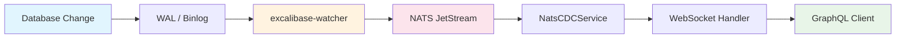

# Real-Time Subscriptions

Excalibase GraphQL provides **real-time data updates** through GraphQL subscriptions powered by [excalibase-watcher](https://github.com/excalibase/excalibase-watcher), NATS JetStream, and WebSocket connections.

## Overview

Real-time subscriptions allow clients to receive instant notifications when database table data changes. Instead of polling for updates, clients establish WebSocket connections and receive events for INSERT, UPDATE, and DELETE operations as they occur.

<div class="feature-grid">
<div class="feature-card">
<h3>Change Data Capture</h3>
<p><a href="https://github.com/excalibase/excalibase-watcher">excalibase-watcher</a> captures database changes via logical replication (PostgreSQL) or binlog (MySQL) and publishes them to NATS JetStream.</p>
</div>

<div class="feature-card">
<h3>NATS JetStream</h3>
<p>Durable, fan-out message streaming ensures every excalibase-graphql pod receives every CDC event — no duplicate replication slots.</p>
</div>

<div class="feature-card">
<h3>WebSocket Transport</h3>
<p>Standards-compliant <code>graphql-transport-ws</code> protocol for reliable, persistent connections.</p>
</div>

<div class="feature-card">
<h3>DDL Auto-Refresh</h3>
<p>Schema changes (CREATE TABLE, ALTER TABLE, etc.) are detected via DDL events and automatically invalidate the GraphQL schema cache — no restart needed.</p>
</div>
</div>

## Architecture


```mermaid
graph LR
    A[Database Change] --> B[WAL / Binlog]
    B --> C[excalibase-watcher]
    C --> D[NATS JetStream]
    D --> E[NatsCDCService]
    E --> F[WebSocket Handler]
    F --> G[GraphQL Client]

    style A fill:#e1f5fe
    style C fill:#fff3e0
    style D fill:#fce4ec
    style G fill:#e8f5e8
```

1. **Database Changes**: INSERT, UPDATE, DELETE operations occur in your database
2. **WAL / Binlog**: The database writes changes to its write-ahead log (PostgreSQL) or binary log (MySQL)
3. **excalibase-watcher**: A standalone CDC server that owns the replication slot / binlog connection and publishes events to NATS JetStream on subjects like `cdc.{schema}.{table}` (DML) and `cdc.{schema}._ddl` (DDL)
4. **NATS JetStream**: Distributes CDC events to all excalibase-graphql pods using ephemeral consumers with `DeliverPolicy.New` (fan-out)
5. **NatsCDCService**: Routes DML events to per-table Reactor Sinks; DDL events trigger schema cache invalidation
6. **WebSocket Delivery**: Events are delivered to subscribed clients via `graphql-transport-ws` WebSocket
7. **Client Processing**: GraphQL clients receive and process real-time updates

### Why excalibase-watcher?

In the previous architecture, each excalibase-graphql pod held its own replication slot / binlog connection. When scaling horizontally, this caused **duplicate CDC events** — pod A and pod B both captured the same change. By moving CDC ownership to a single watcher instance that publishes to NATS, every pod receives every event exactly once through fan-out delivery.

See [excalibase-watcher on GitHub](https://github.com/excalibase/excalibase-watcher) and [excalibase-watcher on Docker Hub](https://hub.docker.com/r/excalibase/excalibase-watcher).

## Supported Databases

| Database | CDC Method | Status |
|----------|-----------|--------|
| **PostgreSQL** | Logical replication (pgoutput) | Supported |
| **MySQL** | Binary log (binlog) | Supported |

## GraphQL Schema

Excalibase automatically generates subscription types for each table in your database:

```graphql
type Subscription {
  # Subscribe to customer table changes
  hanaCustomerChanges: HanaCustomerChangeEvent!

  # Subscribe to orders table changes
  hanaOrdersChanges: HanaOrdersChangeEvent!

  # Health check heartbeat
  health: String
}

# Event structure for table changes
type HanaCustomerChangeEvent {
  table: String!                            # Table name
  schema: String                            # Database schema
  operation: HanaCustomerChangeOperation!   # INSERT, UPDATE, DELETE, ERROR
  timestamp: String!                        # ISO 8601 timestamp
  data: HanaCustomerSubscriptionData        # Row data (structure varies by operation)
  error: String                             # Error message (null if no error)
}

enum HanaCustomerChangeOperation {
  INSERT
  UPDATE
  DELETE
  ERROR
}

# Data payload varies by operation type
type HanaCustomerSubscriptionData {
  # For INSERT: direct column values
  # For DELETE: primary key only (REPLICA IDENTITY DEFAULT)
  customer_id: Int
  first_name: String
  last_name: String
  email: String
  active: Boolean

  # For UPDATE: the updated row is nested under "new"
  old: HanaCustomerSubscriptionData  # Previous values (if available)
  new: HanaCustomerSubscriptionData  # Updated values
}
```

## Operation Types

### INSERT Events

Full row data is included:

```json
{
  "table": "customer",
  "operation": "INSERT",
  "timestamp": "2026-03-25T07:43:24Z",
  "data": {
    "customer_id": 13,
    "first_name": "John",
    "last_name": "Doe",
    "email": "john.doe@example.com",
    "active": true
  },
  "error": null
}
```

### UPDATE Events

Updated row is nested under `new`. With PostgreSQL `REPLICA IDENTITY DEFAULT`, only the new values are sent (no `old`):

```json
{
  "table": "customer",
  "operation": "UPDATE",
  "timestamp": "2026-03-25T07:43:57Z",
  "data": {
    "new": {
      "customer_id": 13,
      "first_name": "Jane",
      "last_name": "Doe",
      "email": "jane.doe@example.com",
      "active": true
    }
  },
  "error": null
}
```

!!! tip "Getting old values in UPDATE events"
    To include old column values, set `REPLICA IDENTITY FULL` on the table:
    ```sql
    ALTER TABLE customer REPLICA IDENTITY FULL;
    ```

### DELETE Events

With `REPLICA IDENTITY DEFAULT`, only the primary key is included:

```json
{
  "table": "customer",
  "operation": "DELETE",
  "timestamp": "2026-03-25T07:44:13Z",
  "data": {
    "customer_id": 13
  },
  "error": null
}
```

### HEARTBEAT Events

Sent every 30 seconds by the subscription resolver to keep the WebSocket connection alive. Note: `HEARTBEAT` is not part of the `ChangeOperation` enum — it is injected by the resolver as a plain string.

```json
{
  "table": "customer",
  "operation": "HEARTBEAT",
  "timestamp": "2026-03-25T07:44:30Z",
  "data": null,
  "error": null
}
```

### ERROR Events

Emitted when the CDC stream encounters an error:

```json
{
  "table": "customer",
  "operation": "ERROR",
  "timestamp": "2026-03-25T07:44:45Z",
  "data": {},
  "error": "NATS connection lost"
}
```

## Client Implementation

### JavaScript/TypeScript (graphql-ws)

Install the required dependencies:
```bash
npm install graphql-ws graphql
```

Basic subscription setup:
```javascript
import { createClient } from 'graphql-ws';

const client = createClient({
  url: 'ws://localhost:10000/graphql',
});

// Subscribe to customer changes
const subscription = client.iterate({
  query: `
    subscription {
      hanaCustomerChanges {
        table
        operation
        timestamp
        data {
          customer_id
          first_name
          last_name
          email
          active
          new {
            customer_id
            first_name
            last_name
            email
          }
        }
        error
      }
    }
  `
});

for await (const event of subscription) {
  const change = event.data.hanaCustomerChanges;
  console.log(`${change.operation} on ${change.table}:`, change);

  switch (change.operation) {
    case 'INSERT':
      console.log('New customer added:', change.data);
      break;
    case 'UPDATE':
      console.log('Customer updated:', change.data.new);
      break;
    case 'DELETE':
      console.log('Customer deleted:', change.data);
      break;
    case 'HEARTBEAT':
      console.log('Connection alive at', change.timestamp);
      break;
    case 'ERROR':
      console.error('Subscription error:', change.error);
      break;
  }
}
```

### React Hook Example

```typescript
import { useEffect, useState } from 'react';
import { createClient } from 'graphql-ws';

interface CustomerChange {
  table: string;
  operation: string;
  timestamp: string;
  data: any;
  error?: string;
}

export function useCustomerSubscription() {
  const [changes, setChanges] = useState<CustomerChange[]>([]);
  const [connected, setConnected] = useState(false);

  useEffect(() => {
    const client = createClient({
      url: 'ws://localhost:10000/graphql'
    });

    const subscription = client.iterate({
      query: `
        subscription {
          hanaCustomerChanges {
            table
            operation
            timestamp
            data {
              customer_id
              first_name
              last_name
              email
              active
              new { customer_id first_name last_name email }
            }
            error
          }
        }
      `
    });

    const processSubscription = async () => {
      try {
        setConnected(true);
        for await (const event of subscription) {
          const change = event.data.hanaCustomerChanges;
          setChanges(prev => [...prev.slice(-99), change]);
        }
      } catch (error) {
        console.error('Subscription error:', error);
        setConnected(false);
      }
    };

    processSubscription();

    return () => {
      client.dispose();
      setConnected(false);
    };
  }, []);

  return { changes, connected };
}
```

### WebSocket Testing with wscat

For testing and debugging, you can use `wscat` to connect directly:

```bash
# Install wscat if not already installed
npm install -g wscat

# Connect to WebSocket endpoint
wscat -c ws://localhost:10000/graphql -s graphql-transport-ws

# Send connection init
{"type":"connection_init"}

# Send subscription request
{
  "type": "subscribe",
  "id": "customer-sub-1",
  "payload": {
    "query": "subscription { hanaCustomerChanges { table operation timestamp data { customer_id first_name last_name email new { customer_id first_name last_name email } } error } }"
  }
}

# You'll receive events in real-time as they occur
```

## Configuration

### Application Configuration

Configure the NATS CDC consumer in your `application.yaml`:

```yaml
app:
  nats:
    enabled: true                    # Enable NATS CDC subscription (default: false)
    url: nats://localhost:4222       # NATS server URL
    stream-name: CDC                 # JetStream stream name (must match watcher config)
    subject-prefix: cdc              # Subject prefix (must match watcher config)
```

### Docker Compose Setup

The `docker-compose.yml` includes all required services:

```yaml
services:
  postgres:
    image: postgres:15-alpine
    command: postgres -c wal_level=logical -c max_replication_slots=10 -c max_wal_senders=10

  nats:
    image: nats:2.10
    command: ["-js", "-m", "8222"]    # JetStream enabled

  excalibase-watcher:
    image: excalibase/excalibase-watcher
    environment:
      APP_CDC_POSTGRES_URL: jdbc:postgresql://postgres:5432/mydb
      APP_CDC_POSTGRES_USERNAME: myuser
      APP_CDC_POSTGRES_PASSWORD: mypassword
      APP_CDC_POSTGRES_ENABLED: true
      APP_CDC_SLOT_NAME: cdc_slot
      APP_CDC_PUBLICATION_NAME: cdc_publication
      APP_CDC_CREATE_SLOT_IF_NOT_EXISTS: true
      APP_CDC_CREATE_PUBLICATION_IF_NOT_EXISTS: true
      APP_NATS_URL: nats://nats:4222
      APP_NATS_STREAM_NAME: CDC
      APP_NATS_SUBJECT_PREFIX: cdc
      APP_NATS_ENABLED: true

  excalibase-app:
    image: excalibase/excalibase-graphql
    environment:
      APP_NATS_ENABLED: true
      APP_NATS_URL: nats://nats:4222
      APP_NATS_STREAM_NAME: CDC
      APP_NATS_SUBJECT_PREFIX: cdc
    depends_on:
      nats:
        condition: service_healthy
      excalibase-watcher:
        condition: service_started
```

### Helm Chart

```yaml
# values.yaml
app:
  nats:
    enabled: true
    url: "nats://nats:4222"
    streamName: "CDC"
    subjectPrefix: "cdc"
```

### PostgreSQL Setup

PostgreSQL logical replication must be enabled for the watcher to connect:

```sql
-- Enable logical replication (requires superuser)
ALTER SYSTEM SET wal_level = logical;
ALTER SYSTEM SET max_replication_slots = 10;
ALTER SYSTEM SET max_wal_senders = 10;
-- Restart PostgreSQL after changing these settings
```

!!! note "excalibase-watcher handles slot and publication creation automatically"
    When `APP_CDC_CREATE_SLOT_IF_NOT_EXISTS=true` and `APP_CDC_CREATE_PUBLICATION_IF_NOT_EXISTS=true`, the watcher will create the replication slot and publication on first startup. No manual SQL setup is needed.

## Performance & Scalability

### Performance Characteristics

- **Low Latency**: Database change to WebSocket delivery in milliseconds
- **High Throughput**: Handles 1000+ concurrent subscriptions
- **Memory Efficient**: Uses Reactor Sinks with backpressure handling
- **Horizontally Scalable**: Every pod receives every event via NATS fan-out

### Horizontal Scaling

The watcher architecture solves the horizontal scaling problem:

| Concern | Old (embedded CDC) | New (watcher + NATS) |
|---------|-------------------|---------------------|
| **Replication slots** | One per pod (N slots for N pods) | One slot total (watcher owns it) |
| **Duplicate events** | Each pod processes every event | Each pod receives every event once via NATS |
| **Scaling** | Adding pods adds replication slots | Adding pods adds NATS consumers (lightweight) |
| **Resource usage** | Each pod holds a DB connection for CDC | Only watcher holds the DB connection |

### DDL Schema Auto-Refresh

When excalibase-watcher detects a DDL change (e.g., `ALTER TABLE`, `CREATE TABLE`), it publishes a DDL event on `cdc.{schema}._ddl`. The `NatsCDCService` receives this event and automatically:

1. Invalidates the schema reflector cache for that schema
2. Invalidates the full GraphQL schema cache
3. The next request rebuilds the GraphQL schema from the updated database

This means **schema changes no longer require an application restart**.

### Monitoring

**NATS Monitoring:**
```bash
# NATS server monitoring (port 8222)
curl http://localhost:8222/jsz?streams=true&consumers=true
```

**Application Metrics:**
- Active subscription count per table
- NATS consumer delivery/ack counts
- WebSocket connection count
- Error rates and types

## Production Deployment

### Security

**WebSocket Security:**
```yaml
# Use secure WebSocket in production
server:
  ssl:
    enabled: true
```

**Database Security:**
```sql
-- Create dedicated replication user for excalibase-watcher
CREATE USER cdc_user WITH REPLICATION;
GRANT SELECT ON ALL TABLES IN SCHEMA public TO cdc_user;
```

### High Availability

- **Watcher**: Deploy a single watcher instance per database (it owns the replication slot). Use Kubernetes restart policies or a standby for HA.
- **NATS**: Deploy a NATS cluster for high availability. JetStream provides persistence.
- **excalibase-graphql**: Deploy multiple pods behind a load balancer. Use sticky sessions or a WebSocket-aware load balancer.

**Client-side reconnection:**
```javascript
const client = createClient({
  url: 'ws://localhost:10000/graphql',
  retryAttempts: 5,
  retryWait: async function* () {
    for (const wait of [1000, 2000, 4000, 8000, 16000]) {
      yield wait;
    }
  }
});
```

### Troubleshooting

**Common Issues:**

1. **Subscription returns "Subscription execution failed"**
    - The `data` field requires subselection — use `data { customer_id first_name ... }` not just `data`
    - Check the GraphQL schema introspection for the correct `*SubscriptionData` type name

2. **No events received**
    - Verify `APP_NATS_ENABLED=true` on both watcher and excalibase-graphql
    - Check NATS stream has messages: `curl http://localhost:8222/jsz?streams=true`
    - Check watcher logs for CDC activity: `docker logs excalibase-watcher`

3. **Connection Refused**
    - Verify NATS is running and reachable
    - Check PostgreSQL logical replication is enabled (`SHOW wal_level;` should return `logical`)

**Debug Logging:**
```yaml
logging:
  level:
    io.github.excalibase.service.NatsCDCService: DEBUG
    io.github.excalibase.config.ws.GraphQLWebSocketHandler: DEBUG
```

## Testing

### Unit Tests

Run the subscription-specific test suite:

```bash
# Test NatsCDCService (NATS consumer, routing, DDL cache invalidation)
mvn test -pl modules/excalibase-graphql-starter -Dtest=NatsCDCServiceTest

# Test subscription implementation (event transformation)
mvn test -pl modules/excalibase-graphql-postgres -Dtest=PostgresDatabaseSubscriptionImplementTest

# Test WebSocket handler
mvn test -pl modules/excalibase-graphql-api -Dtest=GraphQLWebSocketHandlerTest
```

### Integration Testing

Test with a real database using Docker Compose:

```bash
# Start full environment (app + postgres + nats + watcher + observability)
make dev

# Connect to WebSocket for manual testing
wscat -c ws://localhost:10000/graphql -s graphql-transport-ws

# In another terminal, make database changes
make db-shell
INSERT INTO customer (first_name, last_name, email) VALUES ('Test', 'User', 'test@example.com');

# Verify events are received in WebSocket connection
```

## Limitations

### Current Limitations

- **Table-Level Granularity**: Subscriptions are per-table, not query-based
- **No Filtering**: Cannot filter subscription events by column values (all changes for a table are delivered)
- **Single Watcher**: One watcher instance per database (replication slot is single-consumer)

### Future Enhancements

- Row-level subscription filtering based on WHERE conditions
- Cross-table subscription support
- Authentication and authorization for subscription access
- Watcher health-check integration for cache TTL fallback

## Excalibase Ecosystem

| Project | Purpose | Links |
|---------|---------|-------|
| **excalibase-graphql** | Auto-generated GraphQL API | [GitHub](https://github.com/excalibase/excalibase-graphql) · [Docker Hub](https://hub.docker.com/r/excalibase/excalibase-graphql) |
| **excalibase-watcher** | Centralized CDC server (NATS publisher) | [GitHub](https://github.com/excalibase/excalibase-watcher) · [Docker Hub](https://hub.docker.com/r/excalibase/excalibase-watcher) |

## Summary

Real-time subscriptions in Excalibase GraphQL provide a robust, horizontally-scalable solution for streaming database changes to clients. By delegating CDC to [excalibase-watcher](https://github.com/excalibase/excalibase-watcher) and using NATS JetStream for event distribution, the architecture supports multiple pods without duplicate replication slots or events. DDL changes are automatically detected and trigger schema cache invalidation, eliminating the need for application restarts on schema changes.
