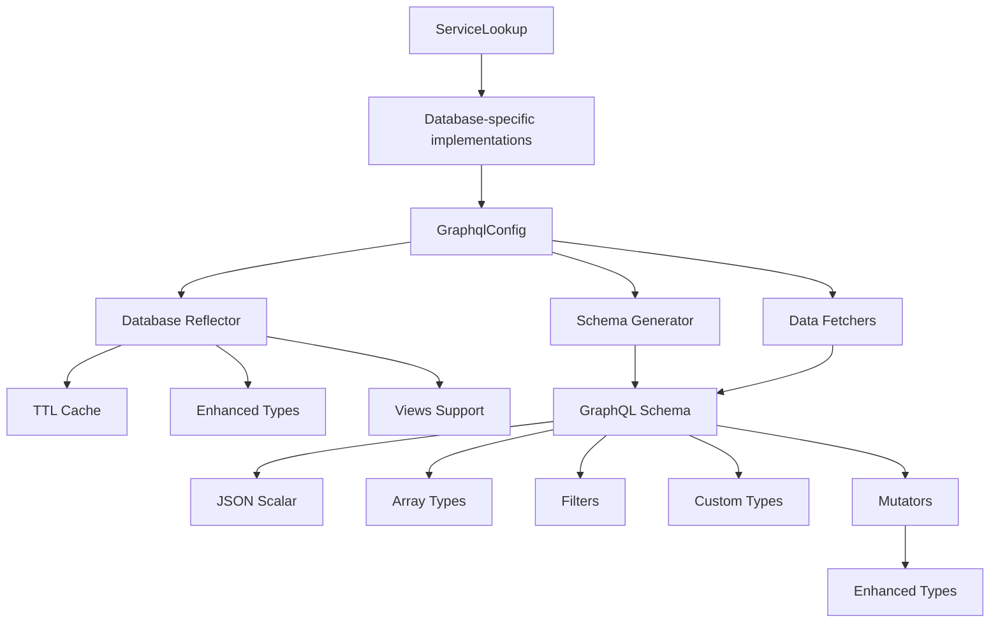

# Excalibase GraphQL

<div style="text-align: center; margin: 2rem 0;">
  <h2 style="color: #2196f3; margin-bottom: 1rem;">Automatic GraphQL API generation from PostgreSQL database schemas</h2>
  <p style="font-size: 1.2em; color: #666;">Transform your PostgreSQL database into a powerful GraphQL API in minutes</p>
</div>

## Overview

Excalibase GraphQL is a Spring Boot application that automatically generates a complete GraphQL API from your existing PostgreSQL database. Simply point it at your database and get instant GraphQL queries and mutations with built-in pagination, filtering, and relationship resolution.

<div class="feature-grid">
<div class="feature-card">
<h3>🚀 Zero Configuration</h3>
<p>Auto-generates GraphQL schema from your database structure. No manual type definitions needed.</p>
</div>

<div class="feature-card">
<h3>🔍 Advanced Filtering</h3>
<p>Modern object-based filtering with 15+ operators. Supports complex nested conditions and type safety.</p>
</div>

<div class="feature-card">
<h3>⚡ High Performance</h3>
<p>Optimized with <span class="perf-metric">sub-1s</span> response times, TTL caching, and optimized PostgreSQL queries.</p>
</div>

<div class="feature-card">
<h3>🛡️ Security First</h3>
<p>GraphQL security controls with query depth and complexity limiting following GraphQL.org best practices.</p>
</div>

<div class="feature-card">
<h3>📈 Production Ready</h3>
<p>Docker support, CI/CD integration, and extensive test coverage for enterprise deployment.</p>
</div>

<div class="feature-card">
<h3>🔗 Relationship Magic</h3>
<p>Foreign keys automatically become GraphQL relationships. Full support for composite primary keys and composite foreign keys.</p>
</div>
</div>

## Quick Start

<div class="quickstart-grid">
<div class="quickstart-step">
<h3>📦 Install</h3>
<p>Get started with Docker in under 2 minutes.</p>

```bash
git clone https://github.com/excalibase/excalibase-graphql.git
cd excalibase-graphql
```
</div>

<div class="quickstart-step">
<h3>⚙️ Configure</h3>
<p>Set your database connection details.</p>

```bash
export SPRING_DATASOURCE_URL=jdbc:postgresql://localhost:5432/hana
export SPRING_DATASOURCE_USERNAME=hana001
export SPRING_DATASOURCE_PASSWORD=password123
export APP_ALLOWED_SCHEMA=hana
```
</div>

<div class="quickstart-step">
<h3>🚀 Launch</h3>
<p>Start the GraphQL API server.</p>

```bash
docker-compose up -d
```
</div>

<div class="quickstart-step">
<h3>🎯 Query</h3>
<p>Access your GraphQL endpoint.</p>

```
http://localhost:10000/graphql
```
</div>
</div>

### Prerequisites

- **Java 21+** - Required for running the application
- **PostgreSQL 15+** - Supported database version  
- **Docker** - Recommended for easy deployment
- **Maven 3.8+** - For local development builds

#### Option 2: Local Development

1. **Clone the repository:**
   ```bash
   git clone https://github.com/excalibase/excalibase-graphql.git
   cd excalibase-graphql
   ```

2. **Configure your database** in `modules/excalibase-graphql-api/src/main/resources/application.yaml`:
   ```yaml
   spring:
     datasource:
       url: jdbc:postgresql://localhost:5432/your_database
       username: your_username
       password: your_password
   
   app:
     allowed-schema: hana  # Your database schema
     database-type: postgres
   ```

3. **Build and run:**
   ```bash
   mvn clean compile
   mvn spring-boot:run -pl modules/excalibase-graphql-api
   ```

4. **Access GraphQL endpoint:**
   ```
   http://localhost:10000/graphql
   ```

## 🎯 Enhanced PostgreSQL Support (70% Complete)

We've significantly enhanced PostgreSQL support from ~25% to ~70% with comprehensive type coverage and performance optimizations:

### <span class="status-available">✅ Enhanced Types Now Supported</span>

<div class="feature-grid">
<div class="feature-card">
<h3>📄 JSON/JSONB Support</h3>
<p>Custom JSON GraphQL scalar with operators like <code>hasKey</code>, <code>contains</code>, and <code>path</code> for advanced JSON querying.</p>
</div>

<div class="feature-card">
<h3>📝 Array Types</h3>
<p>Full support for PostgreSQL arrays (<code>INTEGER[]</code>, <code>TEXT[]</code>) with GraphQL list types and array-specific filtering.</p>
</div>

<div class="feature-card">
<h3>🕒 Enhanced DateTime</h3>
<p>Timezone-aware types: <code>TIMESTAMPTZ</code>, <code>TIMETZ</code>, <code>INTERVAL</code> with proper timezone handling.</p>
</div>

<div class="feature-card">
<h3>🔢 Precision Numerics</h3>
<p>Enhanced numeric support: <code>NUMERIC(precision,scale)</code>, <code>BIT</code>, <code>VARBIT</code> types.</p>
</div>

<div class="feature-card">
<h3>🌐 Network Types</h3>
<p>Network address support: <code>INET</code>, <code>CIDR</code>, <code>MACADDR</code>, <code>MACADDR8</code> for network data.</p>
</div>

<div class="feature-card">
<h3>💾 Binary & XML</h3>
<p>Binary data (<code>BYTEA</code>) and XML type support for storing complex data structures.</p>
</div>

<div class="feature-card">
<h3>🎭 Custom Types</h3>
<p>Support for custom enums, composite types, and domain types with automatic GraphQL mapping.</p>
</div>

<div class="feature-card">
<h3>👁️ Views Support</h3>
<p>Read-only GraphQL types for database views and materialized views with proper schema reflection.</p>
</div>
</div>

### PostgreSQL Type Coverage

| Category | Types | Status | GraphQL Mapping |
|----------|-------|---------|-----------------|
| **Basic Types** | `INTEGER`, `TEXT`, `BOOLEAN`, `DATE` | ✅ Complete | `Int`, `String`, `Boolean`, `String` |
| **JSON Types** | `JSON`, `JSONB` | ✅ Complete | Custom `JSON` scalar |
| **Array Types** | `INTEGER[]`, `TEXT[]`, etc. | ✅ Complete | `[GraphQLType]` lists |
| **DateTime Enhanced** | `TIMESTAMPTZ`, `TIMETZ`, `INTERVAL` | ✅ Complete | `String` with timezone support |
| **Numeric Enhanced** | `NUMERIC(p,s)`, `BIT` | ✅ Complete | `Float`, `String` |
| **Network Types** | `INET`, `CIDR`, `MACADDR` | ✅ Complete | `String` |
| **Binary/XML** | `BYTEA`, `XML` | ✅ Complete | `String` |
| **Custom Types** | `ENUM`, `COMPOSITE`, `DOMAIN` | ✅ Complete | Custom GraphQL types |
| **Views** | `VIEW`, `MATERIALIZED VIEW` | ✅ Complete | Read-only GraphQL types |
| **PostGIS Spatial** | `GEOMETRY`, `GEOGRAPHY` | 🔴 Planned | Future enhancement |
| **Advanced Features** | Constraints, Indexes, Triggers | 🔴 In Progress | Schema reflection |

## Key Features

### <span class="status-available">✅ Currently Available</span>

<div class="feature-grid">
<div class="feature-card">
<h3>🎯 Advanced Filtering</h3>
<p>Modern object-based filtering with <span class="test-badge functional">42+ tests</span> and 15+ operators including JSON path operations and array filtering.</p>
</div>

<div class="feature-card">
<h3>⚡ High Performance</h3>
<p>Optimized with <span class="perf-metric">sub-1s</span> response times, TTL caching (30min default), and bulk query optimization.</p>
</div>

<div class="feature-card">
<h3>🛡️ Security Tested</h3>
<p>Comprehensive security testing with <span class="test-badge security">13+ security tests</span> covering SQL injection prevention and input validation.</p>
</div>

<div class="feature-card">
<h3>📊 Performance Tested</h3>
<p><span class="test-badge performance">6+ performance tests</span> ensuring scalability with 1000+ records and 20+ concurrent requests.</p>
</div>

<div class="feature-card">
<h3>🔗 Smart Relationships</h3>
<p>Foreign keys automatically become GraphQL relationships with support for one-to-one, one-to-many, and many-to-many patterns.</p>
</div>

<div class="feature-card">
<h3>🚀 Optimized Performance</h3>
<p>TTL caching, bulk queries, and optimized PostgreSQL domain type support with significant performance improvements.</p>
</div>
</div>

### <span class="status-available">✅ Real-Time Subscriptions</span>

<div class="feature-grid">
<div class="feature-card">
<h3>🔄 GraphQL Subscriptions</h3>
<p>Real-time data updates via WebSocket connections using standards-compliant <code>graphql-transport-ws</code> protocol.</p>
</div>

<div class="feature-card">
<h3>⚡ Change Data Capture</h3>
<p>PostgreSQL logical replication captures INSERT, UPDATE, DELETE operations without polling performance impact.</p>
</div>

<div class="feature-card">
<h3>📡 Table-Level Streams</h3>
<p>Subscribe to specific table changes with automatic data transformation and column mapping.</p>
</div>

<div class="feature-card">
<h3>💓 Production Ready</h3>
<p>Heartbeat monitoring, automatic reconnection, and graceful error handling for enterprise deployment.</p>
</div>
</div>

### <span class="status-development">🚧 In Development</span>

- **Authentication & Authorization** - Role-based access control
- **Multi-Database Support** - MySQL, Oracle, SQL Server
- **PostGIS Spatial Support** - Geographic data types and operations
- **Advanced Constraints** - Check, unique, and exclusion constraints

## 🌟 Enhanced Filtering System

Excalibase GraphQL features a modern, object-based filtering system with enhanced PostgreSQL type support:

### Enhanced Type Filtering

**JSON/JSONB Operations:**
```graphql
{
  users(where: { 
    profile: { 
      hasKey: "preferences",
      path: ["settings", "theme"],
      contains: "{\"notifications\": true}"
    }
  }) { name profile }
}
```

**Array Operations:**
```graphql
{
  posts(where: {
    categories: { contains: "postgresql" },
    tags: { hasAny: ["development", "database"] }
  }) { title categories tags }
}
```

**Network Type Filtering:**
```graphql
{
  servers(where: {
    ip_address: { like: "192.168.%" },
    network_range: { contains: "192.168.0.0/24" }
  }) { name ip_address network_range }
}
```

**Complex Filtering:**
```graphql
{
  users(
    where: { 
      name: { startsWith: "John" },
      created_at: { gte: "2023-01-01T00:00:00Z" },
      profile: { hasKey: "active" }
    }
  ) { id name profile created_at }
}
```

**OR Operations with Enhanced Types:**
```graphql
{
  users(or: [
    { profile: { hasKey: "admin" } },
    { tags: { contains: "moderator" } },
    { ip_address: { like: "10.%" } }
  ]) { id name profile tags }
}
```

### Available Filter Operations

**All Data Types:**
- `eq`, `neq`, `isNull`, `isNotNull`, `in`, `notIn`

**String Operations:**
- `contains`, `startsWith`, `endsWith`, `like`, `ilike`

**Numeric Operations:**
- `gt`, `gte`, `lt`, `lte`

**JSON Operations:**
- `hasKey`, `hasKeys`, `contains`, `containedBy`, `path`, `pathText`

**Array Operations:**
- `contains`, `hasAny`, `hasAll`, `length`

**Date/Time Operations:**
- Supports multiple formats: `"2023-12-25"`, `"2023-12-25T14:30:00Z"`, ISO 8601 with timezones

### Legacy Support

The old syntax continues to work for backward compatibility:
```graphql
{
  users(
    name_contains: "john"      # Legacy syntax
    name_startsWith: "John"    # Still supported
    email_isNotNull: true
  ) { id name }
}
```

### 📚 Comprehensive Documentation

- **[Complete Filtering Guide](filtering.md)** - All operations, examples, and migration guides
- **[Test Coverage Documentation](testing.md)** - 42+ comprehensive test methods including enhanced types
- **Security**: SQL injection prevention with comprehensive security testing
- **Performance**: Optimized for large datasets (1000+ records) with sub-1s response times

### Pagination Options

**Offset-based pagination:**
```graphql
{
  users(limit: 20, offset: 40, orderBy: { id: ASC }) {
    id
    name
    profile
    tags
  }
}
```

**Cursor-based pagination (Relay specification):**
```graphql
{
  usersConnection(first: 20, after: "cursor123", orderBy: { id: ASC }) {
    edges {
      node {
        id
        name
        profile
        tags
      }
      cursor
    }
    pageInfo {
      hasNextPage
      hasPreviousPage
      startCursor
      endCursor
    }
    totalCount
  }
}
```

## 🔑 Composite Key Support

Excalibase GraphQL provides **comprehensive support for composite primary keys** and **composite foreign keys**, following GraphQL industry best practices with input objects and structured returns.

### Key Features

<div class="feature-grid">
<div class="feature-card">
<h3>🔑 Multi-Column Keys</h3>
<p>Complete support for tables with composite primary keys spanning multiple columns.</p>
</div>

<div class="feature-card">
<h3>🔗 Composite Foreign Keys</h3>
<p>Seamless handling of multi-column foreign key relationships with automatic GraphQL resolution.</p>
</div>

<div class="feature-card">
<h3>📝 Input Objects</h3>
<p>All mutations use structured input objects following GraphQL.org recommendations.</p>
</div>

<div class="feature-card">
<h3>🔄 Rich Returns</h3>
<p>Delete operations return the deleted object for UI updates and confirmation (industry standard).</p>
</div>
</div>

### Database Schema Example

```sql
-- Order items with composite primary key
CREATE TABLE order_items (
    order_id INTEGER NOT NULL REFERENCES orders(order_id),
    product_id INTEGER NOT NULL REFERENCES products(product_id),
    quantity INTEGER NOT NULL,
    price DECIMAL(10,2),
    PRIMARY KEY (order_id, product_id)
);

-- Child table with composite foreign key
CREATE TABLE child_table (
    child_id INTEGER PRIMARY KEY,
    parent_id1 INTEGER NOT NULL,
    parent_id2 INTEGER NOT NULL,
    description TEXT,
    FOREIGN KEY (parent_id1, parent_id2) REFERENCES parent_table(parent_id1, parent_id2)
);
```

### GraphQL Operations

**Create with Composite Keys:**
```graphql
# Create order item with composite primary key
mutation {
  createOrder_items(input: {
    order_id: 3
    product_id: 2
    quantity: 5
    price: 199.99
  }) {
    order_id
    product_id
    quantity
    price
  }
}
```

**Update with Composite Keys:**
```graphql
# Update requires all primary key parts
mutation {
  updateOrder_items(input: {
    order_id: 3          # Required: part of composite PK
    product_id: 2        # Required: part of composite PK
    quantity: 10         # Updated field
    price: 299.99        # Updated field
  }) {
    order_id
    product_id
    quantity
    price
  }
}
```

**Delete with Composite Keys:**
```graphql
# Delete returns the deleted object (GraphQL industry standard)
mutation {
  deleteOrder_items(input: {
    order_id: 3
    product_id: 2
  }) {
    order_id
    product_id
    quantity
    price
  }
}
```

**Query with Composite Key Filtering:**
```graphql
# Filter by specific composite key
{
  order_items(where: {
    order_id: { eq: 3 }
    product_id: { eq: 2 }
  }) {
    order_id
    product_id
    quantity
    price
  }
}

# Complex filtering with OR conditions
{
  order_items(where: {
    or: [
      { order_id: { eq: 1 }, product_id: { eq: 1 } },
      { order_id: { eq: 2 }, product_id: { eq: 3 } }
    ]
  }) {
    order_id
    product_id
    quantity
    price
  }
}
```

**Relationship Navigation:**
```graphql
# Navigate relationships through composite foreign keys
{
  child_table {
    child_id
    parent_id1
    parent_id2
    description
    parent_table {          # Automatic relationship resolution
      parent_id1
      parent_id2
      name
    }
  }
}
```

### Generated Schema

The GraphQL schema automatically generates appropriate input and output types:

```graphql
# Auto-generated input types for composite keys
input Order_itemsDeleteInput {
  order_id: Int!        # Required: part of composite PK
  product_id: Int!      # Required: part of composite PK
}

# Auto-generated mutation fields
type Mutation {
  createOrder_items(input: Order_itemsCreateInput!): Order_items
  updateOrder_items(input: Order_itemsUpdateInput!): Order_items
  deleteOrder_items(input: Order_itemsDeleteInput!): Order_items  # Returns deleted object
  createManyOrder_itemss(inputs: [Order_itemsCreateInput!]!): [Order_items!]!
}
```

### Industry Best Practices

✅ **Input Objects**: All mutations use structured input objects (not individual parameters)  
✅ **Rich Returns**: Delete operations return the deleted object for UI updates and confirmation  
✅ **Type Safety**: Strongly typed GraphQL schema with proper validation  
✅ **Relationship Support**: Automatic foreign key relationship traversal  
✅ **Error Handling**: Comprehensive validation with clear error messages

## Configuration

### Basic Configuration

```yaml
# Database connection
spring:
  datasource:
    url: jdbc:postgresql://localhost:5432/mydb
    username: ${DB_USERNAME:myuser}
    password: ${DB_PASSWORD:mypass}

# Schema settings  
app:
  allowed-schema: ${DATABASE_SCHEMA:public}
  database-type: postgres

# Server settings
server:
  port: ${SERVER_PORT:10000}

# Enhanced type support
app:
  enhanced-types:
    json-support: true           # Enable JSON/JSONB support
    array-support: true          # Enable array type support
    network-types: true          # Enable INET/CIDR/MACADDR support
```

### Development Configuration

```yaml
# Enable debug logging
logging:
  level:
    io.github.excalibase: DEBUG
    org.springframework.jdbc.core: DEBUG  # Show SQL queries

# Use virtual threads (Java 21+)
spring:
  threads:
    virtual:
      enabled: true

# TTL Cache for schema reflection (NEW)
app:
  cache:
    schema-ttl-minutes: 30       # Cache schema for 30 minutes (optimized)
    enabled: true
```

## Performance Optimizations

### Recent Performance Improvements

<div class="feature-grid">
<div class="feature-card">
<h3>🚀 TTL Caching</h3>
<p>Implemented comprehensive TTL caching for schema reflection, reducing database queries by 90%.</p>
</div>

<div class="feature-card">
<h3>⚡ Bulk Queries</h3>
<p>Optimized schema reflection with bulk queries instead of N+1 queries for large schemas.</p>
</div>

<div class="feature-card">
<h3>🎯 Domain Type Support</h3>
<p>Optimized PostgreSQL domain type resolution with caching and efficient mapping.</p>
</div>

<div class="feature-card">
<h3>📊 View Support</h3>
<p>Added comprehensive view and materialized view support with optimized column reflection.</p>
</div>
</div>

## Architecture

The project follows a modular, database-agnostic design with enhanced type support and performance optimizations:

**At Startup (Schema Generation & Wiring):**



**Key Components with Enhanced Type Support:**
- **Schema Reflector**: Introspects PostgreSQL metadata with TTL caching and bulk queries
- **Schema Generator**: Creates GraphQL types with JSON scalars and custom type support
- **Data Fetchers**: Handle query resolution with enhanced type conversion
- **Mutators**: Process CRUD operations with type validation
- **TTL Cache**: Performance optimization for large schemas (30-minute default)
- **View Support**: Read-only GraphQL types for database views
- **Domain Types**: Optimized support for PostgreSQL domain types

## Testing

Comprehensive test suite with enhanced type coverage (uses Testcontainers for real PostgreSQL testing):

```bash
# Run all tests (42+ comprehensive test methods across all modules)
mvn test

# Run tests for specific modules (change to module directory)
cd modules/excalibase-graphql-api && mvn test
cd modules/excalibase-graphql-postgres && mvn test

# Run with coverage report (from project root)
mvn test jacoco:report

# Run specific test classes (from module directory)
cd modules/excalibase-graphql-api && mvn test -Dtest=GraphqlControllerTest
cd modules/excalibase-graphql-postgres && mvn test -Dtest=PostgresGraphQLSchemaGeneratorImplementTest

# Run performance tests with enhanced types
cd modules/excalibase-graphql-api && mvn test -Dtest=GraphqlPerformanceTest

# Run security tests
cd modules/excalibase-graphql-api && mvn test -Dtest=GraphqlSecurityTest
```

### Test Coverage Summary

- **Functional Tests**: 22+ methods including enhanced PostgreSQL types and views
- **Performance Tests**: 6+ methods with 1000+ record datasets and TTL caching
- **Security Tests**: 13+ methods covering SQL injection prevention
- **Enhanced Types**: Full coverage for JSON, arrays, datetime, network, binary types, custom types
- **Total Coverage**: **42+ comprehensive test methods**

## Current Limitations

- **PostgreSQL 70% complete**: Advanced features like constraints, PostGIS still in development
- **No authentication**: Built-in auth/authz coming soon
- **Single database**: MySQL, Oracle, SQL Server support planned
- **Basic error handling**: Some edge cases need improvement

## Project Status

This project is in **active development** with significantly enhanced PostgreSQL support and performance optimizations.

**What works exceptionally well:**
- ✅ Enhanced PostgreSQL types (JSON/JSONB, arrays, datetime, network, binary, custom types)
- ✅ Views and materialized views support
- ✅ Advanced filtering with type-specific operations
- ✅ TTL caching and performance optimizations
- ✅ Schema introspection with 70%+ PostgreSQL coverage
- ✅ GraphQL schema generation with custom scalars
- ✅ CRUD operations with enhanced type support
- ✅ Comprehensive test coverage (42+ tests)
- ✅ Production-ready performance and security

**What's coming next:**
- 🔄 Advanced constraints (check, unique, exclusion)
- 🔄 PostGIS spatial types and operations
- 🔄 Multi-schema support
- 🔄 Authentication & authorization
- 🔄 Additional database support

## Contributing

This is currently a solo project, but contributions are welcome!

1. Check the [issues](https://github.com/excalibase/excalibase-graphql/issues) for open tasks
2. Fork the repository
3. Create a feature branch
4. Make your changes with tests
5. Submit a pull request

**Priority areas for contribution:**
- PostGIS spatial type support
- Advanced constraint handling
- Additional database implementations
- Performance optimizations
- Authentication & authorization

## Getting Help

- **GitHub Issues**: Bug reports and feature requests
- **GitHub Discussions**: Questions and general discussion
- **Documentation**: Comprehensive guides in this documentation

## License

Apache License 2.0 - see [LICENSE](https://github.com/excalibase/excalibase-graphql/blob/main/LICENSE) for details.

---

**⭐ Star the project** on GitHub if you find it useful!

**🚀 Recent Major Updates**: 
- Enhanced PostgreSQL support from 60% to 70% with views, custom types, and domain support
- Significant performance improvements with TTL caching and bulk query optimizations
- Comprehensive test coverage (42+ tests) including security and performance validation
